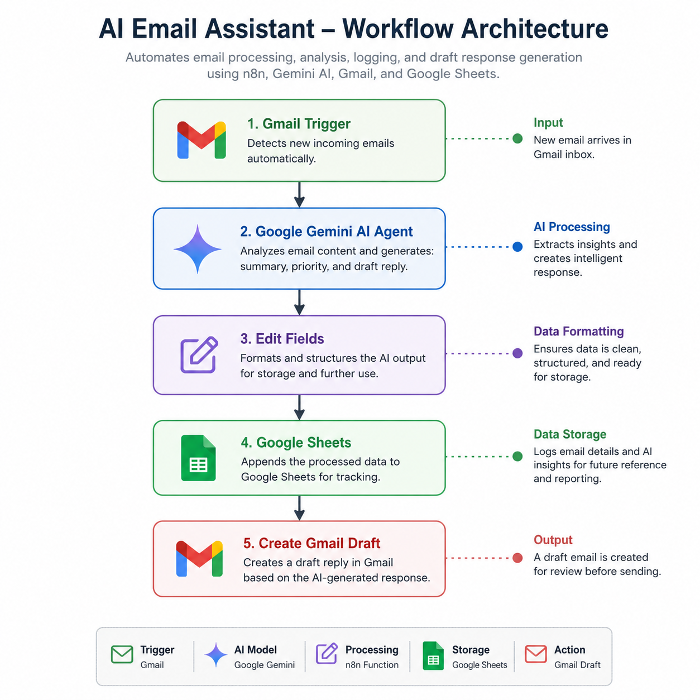

# AI Email Workflow Assistant

## Overview

AI Email Workflow Assistant is an automation workflow built with n8n, Google Gemini, Gmail, and Google Sheets.

The workflow automatically processes incoming emails, generates AI-powered insights, stores the results, and creates a draft response. This reduces the time spent manually reviewing emails while maintaining human oversight before sending replies.

---

## Problem

Professionals and teams often spend significant time reading emails, identifying priorities, and drafting responses. Repetitive email processing can reduce productivity and delay important actions.

This project demonstrates how AI and workflow automation can assist in handling incoming emails more efficiently.

---

## Solution

The workflow automatically:

* Detects new incoming emails using Gmail
* Uses Google Gemini to analyze the email
* Generates:

  * Summary
  * Priority classification
  * Draft response
* Stores the processed information in Google Sheets
* Creates a Gmail draft for review before sending

This enables faster email triage while keeping the user in control of final communication.

---

## Workflow Architecture


---

## Features

### Email Monitoring

Automatically detects newly received emails.

### AI-Powered Analysis

Google Gemini analyzes email content and generates:

* Summary
* Priority level
* Suggested reply

### Data Logging

Stores processed results in Google Sheets for tracking and reporting.

### Draft Generation

Creates a Gmail draft that can be reviewed and sent manually.

---

## Technologies Used

* n8n
* Google Gemini API
* Gmail API
* Google Sheets API
* Containerization: Docker, Docker Compose

---

## Example Output

### Input Email

```text
Hi Ashvin,

Please prepare the project report before Friday and send it to the team.
```

### AI Analysis

```text
Summary:
Project report must be completed and shared before Friday.

Priority:
Normal

Draft Reply:
Thank you for the reminder. I will prepare the report and share it before Friday.
```

---

## Future Improvements

* Automatic email categorization
* Sentiment analysis
* Multi-agent workflow design
* Knowledge-base retrieval (RAG)
* Slack and Microsoft Teams integrations
* Analytics dashboard
* Human approval workflows

---

## Quick Start

### Clone Repository

```bash
git clone <repository-url>
cd ai-email-workflow-assistant
```

### Start n8n

```bash
docker compose up -d
```

### Open n8n

```text
http://localhost:5678
```

### Import Workflow

Import the provided `workflow.json` file into n8n and configure:

* Gmail credentials
* Gemini API credentials
* Google Sheets credentials

---

## Learning Outcomes

This project explores:

* Workflow automation
* AI-assisted productivity
* Prompt engineering
* API integrations
* Event-driven architectures
* Agentic AI fundamentals

---
